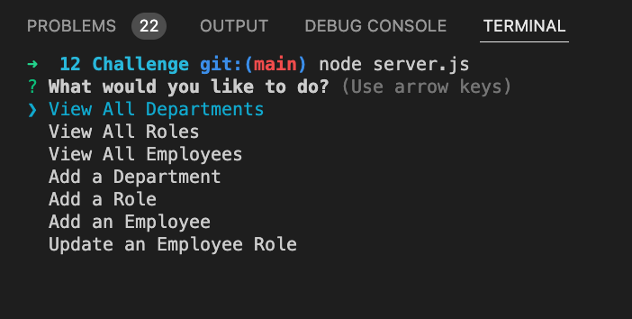

# Employee Tracker
<p />By Michael Martens

[](https://opensource.org/licenses/MIT)

## Description
Use this tool to search and interact with a database of employees (or anything else you want to store).


<br>

## Table of Contents
[Installation](#installation)<br />[Usage](#usage)<br />[License](#license)<br />[Contributing](#contributing)<br />[Tests](#tests)<br />[Questions](#questions)

## Installation
Clone the repo > run ```npm install``` to intialize the included dependencies

You will also need to make sure that MySql is installed.

## Usage
Source and Seed the database by navigating to the ```db``` folder and running ```mysql -u root -p``` to log into the database. Run ```source schema.sql``` followed by ```source seed.sql``` followed by ```quit``` to cd back into the root folder and begin using the application.

Run ```node server.js``` to launch the app > arrow through options.

## License
This project is licensed under the MIT license.

A short and simple permissive license with conditions only requiring preservation of copyright and license notices. Licensed works, modifications, and larger works may be distributed under different terms and without source code.<p />For more information visit https://choosealicense.com/licenses/mit/.

## Contributing
Other than what I learned in class, just myself! I grabbed most of my inspiration from the provided resources.

## Tests
None

## Questions
Find me on Github at https://github.com/makeithappenmike<p/>You can reach me at omichaelaaron@gmail.com if you have any questions.